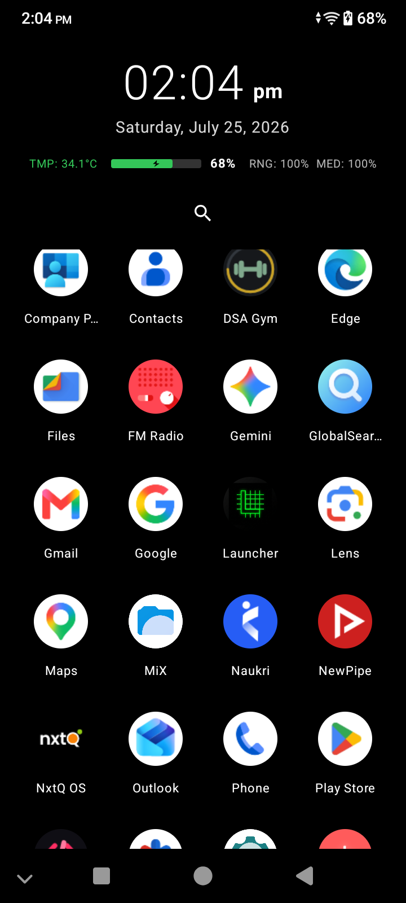
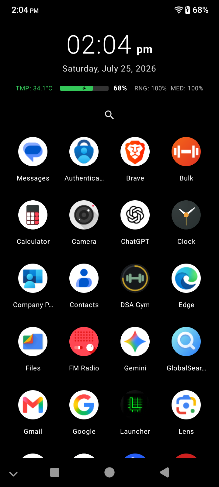

# ⚡ Lightest Launcher

  
  
  

A radically minimalist, ultra lightweight Android launcher engineered from the ground up to achieve **absolute zero battery drain**.

## The Engineering Achievement

Most modern launchers are battery hogs in disguise. They run invisible background services, poll your CPU constantly to update widgets, and use heavy loops to track the time and your battery percentage. 

We threw all of that out the window and flipped the script on how a launcher is built. 

Every single line of code in the **Lightest Launcher** is designed around Android's native passive broadcasting system. 

*   **Zero Polling Engine**: Instead of waking up your CPU 60 times a minute to check the clock, we hooked directly into Android's native `ACTION_TIME_TICK`. Our launcher does literally zero work for 59 seconds and only wakes up exactly when the OS tells it the minute rolled over.
*   **Passive Diagnostics**: The battery and temperature HUD never asks the phone for data. It simply sits silently and waits for the battery hardware to broadcast an update.
*   **Pure OLED Black**: By rendering true black hex pixels across the board, the launcher actually turns off the physical pixels on OLED screens to save raw hardware power.

## Intentional Trade-offs

To hit absolute maximum performance and maintain a zero battery footprint, we had to make some hardcore design decisions. These aren't missing features. They are intentional exclusions:

*   **No Widgets**: Widgets require continuous background memory allocation and CPU cycles to stay updated. We refuse to run them.
*   **No Wallpapers**: Rendering high resolution images on the home screen drains your battery and causes permanent OLED burn-in over time. We use a pure black background exclusively.
*   **No Heavy Animations**: No app drawer opening lag. We launch your apps instantly.

## Features At A Glance

*   **Passive Battery & Temperature HUD**: Realtime diagnostics exactly when they happen, zero polling required.
*   **Smart Temperature Colors**: The HUD temperature seamlessly shifts from Green to Orange to Bold Red so you instantly know when your device is overheating.
*   **Integrated Volume Tracking**: View your exact ring profile and media volume on the HUD.
*   **Smart Charging Indicator**: A clean, lightning fast vector icon appears the millisecond you plug in.
*   **Instant App Search**: Filter through your entire device in milliseconds.

## Installation

Go to the **Releases** tab and download the highly optimized `app-release.apk`. It is entirely minified and shrank through Google's aggressive R8 optimizer to take up practically zero storage on your phone.

Enjoy the fastest, most efficient Android experience ever built.
