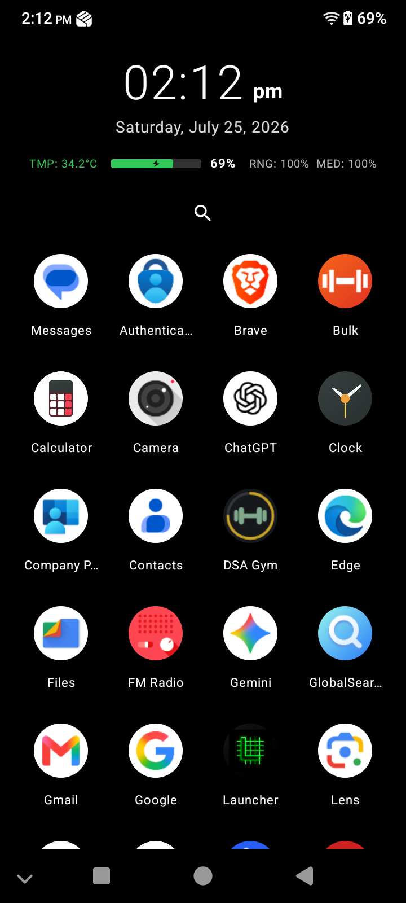

# Lightest Launcher

A minimalist, ultra lightweight Android launcher designed for absolute zero battery drain and maximum efficiency. 

## Why is it the Lightest?

Modern launchers are filled with background services, heavy animations, and constant polling that quietly consume battery life. We built Lightest Launcher to fix that. 

Every single feature in this launcher has been meticulously crafted to ensure **zero background battery consumption**. We rely entirely on native, passive Android system broadcasts rather than active polling. 

## Intentional Trade-offs

To achieve absolute maximum performance and zero battery drain, we made some hard choices. These are not missing features; they are intentional exclusions:

*   **No Widgets**: Widgets require continuous background processes and memory allocation to stay updated.
*   **No Wallpapers**: Rendering high resolution images on the home screen drains battery and causes OLED burn-in. We use a pure black background.
*   **No App Drawer Animations**: We launch apps instantly.

## Features

*   **Pitch Black OLED Theme**: Pure black background saves battery on OLED screens and looks incredibly sleek.
*   **Passive Battery & Temperature HUD**: We track the exact battery percentage and device temperature entirely passively. It only updates when Android broadcasts a change, meaning zero polling and zero drain.
*   **Smart Temperature Colors**: The HUD temperature changes from green to orange to red to give you instant visual feedback on device heat.
*   **Integrated Volume Tracking**: View your ring profile and media volume instantly.
*   **Ultra Optimized Clock**: We replaced standard second by second looping with Android's native passive time tick receiver. The clock does absolutely no work until the minute rolls over.
*   **Smart Charging Indicator**: A clean vector lightning bolt appears instantly when you plug in, without loading heavy image assets.
*   **Instant Search**: Filter through your apps instantly.

## Installation

Go to the Releases tab and download the highly optimized `app-release.apk`. It has been minified and shrunk to take up virtually no space on your device.

Enjoy the fastest, lightest experience possible.
